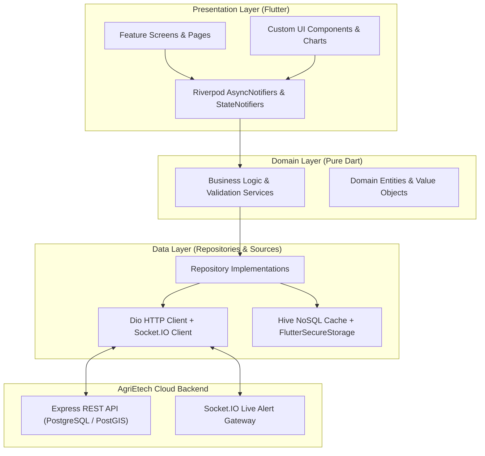

# AgriEtech Flutter Mobile Client

> Cross-Platform Multi-Hazard Early Warning & Agro-Climate Advisory System for Ethiopia

---

## System Overview

AgriEtech is a dual-mode Flutter mobile application engineered for smallholder farmers, agricultural development agents, and Woreda agricultural officers across Ethiopia. The platform connects users directly to real-time agrometeorological intelligence, satellite-derived risk analytics, and localized advisory services.

The application operates in a **Hybrid Dual-Mode** model:
- **Connected Mode (Online)**: Streams live multi-hazard sensor feeds, receives instant WebSocket alerts, conducts real-time AI leaf disease diagnoses via cloud inference, downloads high-resolution map tiles, and synchronizes farm telemetry with the backend PostgreSQL/PostGIS database.
- **Resilient Mode (Offline)**: Automatically persists forecasts, advisories, hazard zones, and farm boundaries to a local Hive NoSQL database. Field workers can record farm polygons, log crop symptoms, and review advisories with zero connectivity; all offline mutations queue locally and automatically reconcile upon reconnection.

### Core Capabilities

- **Multi-Hazard Risk Engine**: Real-time composite scoring and spatial visualization for Drought (SPI), Flood (GloFAS river discharge), Desert Locust (FAO swarm tracking), and Vegetation Stress (MODIS/Sentinel-2 NDVI).
- **Dual-Mode Data Layer**: Online live HTTP/WebSocket communication paired with transparent Hive NoSQL caching for zero-latency screen transitions (<16ms) and uninterrupted field productivity.
- **Bilingual Interface**: Native support for **Amharic (አማርኛ)** with complete Ge'ez script typography alongside **English**.
- **Interactive Farm Geofencing**: GPS boundary drawing and acreage calculation on OpenStreetMap using `flutter_map`.
- **Agrometeorological Visualizations**: 16-day meteograms, hourly temperature curves, dekadal rainfall charts, and seasonal Belg/Kiremt anomaly analytics using `fl_chart`.
- **AI Crop Pathology**: Camera capture workflow for on-field crop disease diagnosis with localized treatment recommendations.
- **Multi-Channel Alert Dispatch**: Live WebSocket notifications on the app, backed by automated SMS and USSD fallback for non-smartphone users.

---

## Technical Architecture

The frontend strictly enforces **Clean Architecture** organized by **Feature-First** modular boundaries.



---

## Directory Organization

```
agrietech-frontend/
├── assets/
│   ├── images/                          # Agro-illustrations and branded graphics
│   ├── icons/                           # Hazard indicators (drought, flood, locust, leaf)
│   └── translations/
│
├── lib/
│   ├── main.dart                        # Application bootstrap, Hive initialization, ProviderScope
│   ├── app.dart                         # MaterialApp.router, Material 3 theme configuration, l10n
│   │
│   ├── core/                            # Cross-cutting foundational infrastructure
│   │   ├── config/
│   │   │   ├── env.dart                 # Environment configuration (API and WebSocket URLs)
│   │   │   ├── app_theme.dart           # Agricultural green and severity color palette tokens
│   │   │   └── app_router.dart          # GoRouter declarations with bottom navigation shell
│   │   ├── constants/
│   │   │   ├── api_endpoints.dart       # REST API route constants
│   │   │   └── app_constants.dart       # Business thresholds and cache expiry durations
│   │   ├── network/
│   │   │   ├── dio_client.dart          # Configured Dio HTTP client with retry and timeout policies
│   │   │   ├── api_interceptors.dart    # JWT Bearer authentication and refresh interceptors
│   │   │   └── socket_client.dart       # Socket.IO client for live woreda alert broadcasts
│   │   ├── storage/
│   │   │   ├── secure_storage_service.dart  # Encrypted keystore storage for auth tokens
│   │   │   ├── hive_service.dart            # Hive database lifecycle and adapter registration
│   │   │   └── local_cache_boxes.dart       # Cache box identifiers
│   │   ├── localization/
│   │   │   ├── app_localizations.dart   # Localization lookup contracts
│   │   │   └── l10n/
│   │   │       ├── app_en.arb           # English translation catalog
│   │   │       └── app_am.arb           # Amharic (አማርኛ) translation catalog
│   │   ├── utils/
│   │   │   ├── date_utils.dart          # Ethiopian (Ge'ez) calendar converters
│   │   │   ├── geo_utils.dart           # GPS coordinates and polygon geometry helpers
│   │   │   └── validators.dart          # Ethiopian phone number and form validators
│   │   └── widgets/
│   │       ├── period_toggle.dart       # Daily / Dekadal / Monthly / Seasonal filter control
│   │       ├── risk_badge.dart          # Severity indicator: LOW / MODERATE / HIGH / CRITICAL
│   │       ├── loading_indicator.dart   # Shimmer skeleton and progress indicators
│   │       └── error_view.dart          # Network and system error view with retry callback
│   │
│   ├── features/                        # 14 isolated domain modules
│   │   ├── auth/                        # Phone authentication, registration, OTP verification
│   │   ├── boundaries/                  # Region -> Zone -> Woreda administrative selector
│   │   ├── farms/                       # Farm profile management and polygon map editor
│   │   ├── weather/                     # 16-day meteogram and historical weather analytics
│   │   ├── drought/                     # Radial SPI drought gauge and precipitation deficit
│   │   ├── flood/                       # GloFAS discharge hydrographs and flood return periods
│   │   ├── vegetation/                  # MODIS / Sentinel-2 NDVI vegetation health curves
│   │   ├── locustPest/                  # FAO desert locust swarm tracking and proximity alerts
│   │   ├── soil/                        # SoilGrids nutrient and moisture composition gauges
│   │   ├── diseaseDiagnosis/            # Leaf photography capture and AI diagnostic results
│   │   ├── riskDashboard/               # Composite Woreda risk score and multi-hazard map
│   │   ├── alerts/                      # Advisory notification center with bilingual content
│   │   ├── analytics/                   # Multi-year historical climatology comparisons
│   │   └── offlineSync/                 # Workmanager queue for background synchronization
│   │
│   └── shared/                          # Generic API response envelope and context extensions
│
└── docs/                                # Technical documentation suite
    ├── ARCHITECTURE_OVERVIEW.md         # Layer design, dual-mode data model, and dependency rules
    ├── STATE_MANAGEMENT_GUIDE.md        # Riverpod 2.x AsyncNotifier and caching patterns
    ├── UI_UX_DESIGN_SYSTEM.md           # Material 3 tokens, accessibility, and typography
    ├── FEATURE_ROADMAP.md               # Screen specifications and acceptance criteria
    └── TEAM_ASSIGNMENT_GUIDE.md         # Frontend developer responsibilities and checklists
```

---

## Getting Started

### Prerequisites

| Requirement | Supported Version | Notes |
|---|---|---|
| Flutter SDK | `>= 3.19.0` | Channel `stable` |
| Dart SDK | `>= 3.3.0` | Bundled with Flutter SDK |
| Java Development Kit | OpenJDK 17 | Required for Android build toolchain |
| Android SDK Platform | API Level 34 | Android 14.0 |
| Development Tools | VS Code / Android Studio | Flutter & Dart plugins installed |

### Installation and Run

```bash
# 1. Clone the repository
git clone https://github.com/your-org/agrietech-frontend.git
cd agrietech-frontend

# 2. Configure environment parameters
cp .env.example .env

# 3. Retrieve package dependencies
flutter pub get

# 4. Run the code generation engine (if modifying models)
dart run build_runner build --delete-conflicting-outputs

# 5. Launch the application on a target device or emulator
flutter run
```

---

## Development Team & Engineering Ownership

The frontend client is engineered and maintained by a team of 5 developers, each leading dedicated feature slices:

| # | Engineer | Student ID | Primary Frontend Domains | Key Module Responsibilities |
|---|---|---|---|---|
| 1 | **Abraham Amogne** | `CTC-329-26` | **Frontend Lead · Core Infra & AI Diagnostics** | Application lifecycle, GoRouter navigation shell, Material 3 theme system, SecureStorage auth tokens, AI leaf camera diagnosis, and master risk dashboard. |
| 2 | **Abenezer Endrias** | `CTC-1826-26` | **Farm Geofencing & Administrative Maps** | Region/Zone/Woreda cascading selectors, interactive `flutter_map` GPS polygon drawing, and plot acreage computation. |
| 3 | **Abinu Mathewos** | `CTC-1258-26` | **Weather Visualizations & Agro-Analytics** | 16-day numerical weather meteograms, hourly temperature curves, dekadal rainfall charts, and Belg/Kiremt seasonal analytics. |
| 4 | **Alen Biruk** | `CTC-2176-26` | **Drought Risk & Hydrology UI** | Radial SPI drought meter, precipitation deficit trend charts, GloFAS river discharge hydrographs, and flood return-period badges. |
| 5 | **Banchamlak Golla** | `CTC-2952-26` | **Vegetation, Locust Alerts & Offline Sync** | MODIS/Sentinel-2 NDVI trend lines, FAO locust swarm map overlays with GPS proximity alerts, SoilGrids nutrient bars, and Workmanager sync queue. |

---

## Technical Documentation Hub

The [`docs/`](./docs/) directory contains essential technical specifications for frontend developers:

| Document | Focus Area |
|---|---|
| [Architecture Overview](./docs/ARCHITECTURE_OVERVIEW.md) | Clean Architecture layers, dual-mode operational model, and directory boundaries. |
| [State Management Guide](./docs/STATE_MANAGEMENT_GUIDE.md) | Riverpod 2.x `AsyncNotifier` patterns, Hive caching integration, and UI consumer templates. |
| [UI/UX Design System](./docs/UI_UX_DESIGN_SYSTEM.md) | Material 3 design tokens, Amharic Ge'ez typography (Noto Sans Ethiopic), and hazard color palettes. |
| [Feature Roadmap](./docs/FEATURE_ROADMAP.md) | 14 feature domain screens, custom widget structures, and technical acceptance criteria. |
| [Team Assignment Guide](./docs/TEAM_ASSIGNMENT_GUIDE.md) | Developer feature assignments, file boundaries, and quality checklists. |

---

## License

Proprietary — AgriEtech Engineering Team. All rights reserved.
