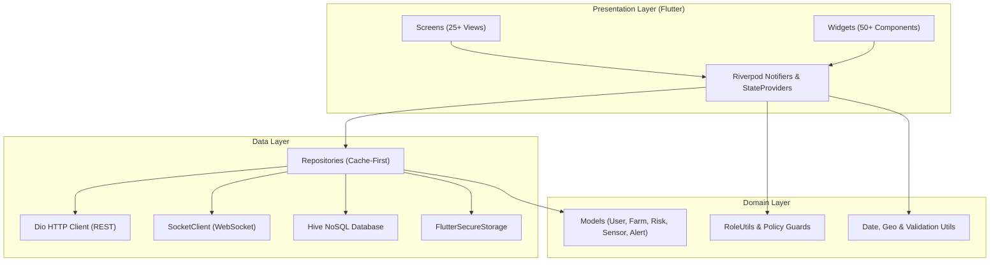

# agriEtech — Multi-Hazard Early Warning & Agriculture Advisory System

**Production-ready Flutter cross-platform client (Android, iOS, Web, Desktop) for agricultural multi-hazard monitoring, AI crop pathology, IoT telemetry, and early warning in Ethiopia.**

---

## 🌟 Overview

**agriEtech** connects smallholder farmers, development agents, woreda officers, and agricultural researchers to real-time climatological hazard models, AI crop pathology, OpenStreetMap farm geofencing, and IoT telemetry streams.

- **Status**: ✅ **100% Complete — 50/50 Tests Passing — 0 Analyzer Issues**
- **Brand Identity**: 3-Segment `agriEtech` Typography (`agri` + `E` + `tech`) with Forest Green (`#2E7D32` / `#1B5E20`) Material 3 Theme
- **Target Platforms**: Android, iOS, Web, Windows, macOS, Linux
- **Backend Service**: Node.js REST API + Socket.IO WebSockets (`agriEtech-backend`)
- **Architecture**: Clean Architecture with Riverpod 2.x State Management & Cache-First Offline Persistence

---

## 👥 Development Team & Module Assignments

| # | Team Member | Student ID | Role | Owned Module Domains |
|---|---|---|---|---|
| **1** | **Abraham Amogne** | `CTC-329-26` | 🏆 **Team Lead & Core Frontend** | `lib/core/*` (Network, Storage, Theme, Routing, Utils, Widgets)<br>`lib/features/auth/` · `lib/features/boundaries/` · `lib/features/home/` |
| **2** | **Abenezer Endrias** | `CTC-1826-26` | 🌤️ **Weather & Analytics Engineer** | `lib/features/weather/` (16-day forecast, meteograms, ET0)<br>`lib/features/analytics/` (Belg vs. Kiremt seasonal climatology) |
| **3** | **Abinu Mathewos** | `CTC-1258-26` | 🌱 **Farms, Soil & AI Pathology Engineer** | `lib/features/farms/` (GPS polygon mapping, geofencing)<br>`lib/features/soil/` (SoilGrids pH & moisture)<br>`lib/features/diagnosis/`, `disease/`, `disease_diagnosis/` |
| **4** | **Alen Biruk** | `CTC-2176-26` | 🛡️ **Multi-Hazard Dashboards Engineer** | `lib/features/dashboard/`, `risk/`, `risk_dashboard/` (Composite index)<br>`lib/features/drought/` (SPI gauge) · `lib/features/flood/` (GloFAS hydrograph)<br>`lib/features/vegetation/` (NDVI) · `lib/features/locust_pest/` (FAO swarm radar) |
| **5** | **Banchamlak Golla** | `CTC-2952-26` | 📡 **Alerts, IoT Sensors & Sync Engineer** | `lib/features/alerts/` (Real-time push, WebSocket, inbox)<br>`lib/features/sensors/` (IoT telemetry & battery alerts)<br>`lib/features/offline_sync/` (Workmanager & Hive queue) |

---

## ✨ Core Feature Domains

### 1. 🔐 Authentication & Role-Based Access Control
- JWT-based authentication supporting login via **Username or Email** with encrypted token keystore.
- Forgot Password reset dialog with backend token dispatch.
- 5 User Roles with granular capability enforcement: `FARMER`, `DEVELOPMENT_AGENT`, `WOREDA_OFFICER`, `RESEARCHER`, `ADMIN`.

### 2. 🛡️ Multi-Hazard Composite Dashboard
- Master Woreda risk score uniting 6 hazard types: Drought, Flood, Locust Swarms, Vegetation Stress, Frost, and Heat Stress.
- Color-coded severity indicators (Low, Moderate, High, Critical).
- Role-specific quick actions and immediate summary banners.

### 3. 🗺️ Farm Geofencing & GPS Mapping
- Interactive OpenStreetMap drawing tool with `flutter_map` and `latlong2`.
- Automatic polygon area calculation (hectares) and centroid coordinates.
- Selection of 14 Ethiopian staple crops, soil types, and irrigation methods.

### 4. 🌤️ Weather Forecasting & Climatology Analytics
- 16-day Open-Meteo predictions with hourly temperature spline curves.
- Interactive meteogram with precipitation amounts and touch tooltips.
- Solar radiation, humidity, wind velocity, and ET0 evapotranspiration metrics.
- Seasonal climatology comparisons (Belg vs. Kiremt seasons) with dekadal trends.

### 5. 🔬 AI Crop Pathology & Disease Diagnosis
- Camera viewfinder capture and gallery image analysis.
- AI disease classification with confidence percentage score.
- Localized actionable treatment plans and prevention tips in English and Amharic.

### 6. 📡 IoT Sensor Fleet Management & Telemetry
- Supports 4 sensor types: Soil Moisture, Temperature, Rain Gauge, and Leaf Wetness.
- Real-time telemetry line charts with configurable time horizons (24h, 7d, 30d).
- Low battery alerts (< 20%) and sensor operational health tracking.

### 7. 🚨 Real-Time Advisories & Alert Inbox
- Live Socket.IO WebSocket stream + Firebase Cloud Messaging push advisories.
- 3 Priority Channels (Critical, High, General) with severity filtering.
- Role-gated alert creation for Woreda Officers and Administrators.

### 8. 🏜️ Drought, Flood, Locust & NDVI Specialized Views
- **Drought**: Radial animated needle SPI gauge (SPI-30 / SPI-90) and deficit trends.
- **Flood**: GloFAS river discharge hydrographs with 2-year, 5-year, and 20-year return period alarms.
- **NDVI**: MODIS & Sentinel-2 satellite vegetation health against 10-year baselines.
- **Locust Radar**: FAO swarm polygon map overlays and real-time proximity alerts (≤ 50 km).

### 9. 📴 Offline-First Synchronization Architecture
- High-speed Hive NoSQL local key-value caching across 6 core boxes.
- `pending_actions` queue flushed via Workmanager background jobs when connectivity is restored.
- Conflict resolution policies: Last-Write-Wins, Server-Authoritative, and Append-Only.

---

## 🏗️ Technical Architecture



---

## 🚀 Getting Started

### Prerequisites
- Flutter SDK `>= 3.0.0`
- Dart SDK `>= 3.0.0`
- Node.js backend running on `localhost:5000` (or `10.0.2.2:5000` for Android emulator)

### Installation & Run

```bash
# 1. Clone repository and navigate to folder
cd c:\Users\a\Desktop\agrietech-frontend

# 2. Install dependencies
flutter pub get

# 3. Verify code quality & tests
flutter analyze
flutter test

# 4. Run application
flutter run -d chrome     # Run on Web (Chrome)
flutter run -d windows    # Run on Windows Desktop
flutter run -d edge       # Run on Microsoft Edge
```

---

## 🧪 Quality & Test Suite Verification

| Test Suite | File | Tests | Status |
|---|---|---|---|
| **AgriEtechLogo** | `test/core/agrietech_logo_test.dart` | 5 | ✅ Pass |
| **App Theme** | `test/core/app_theme_test.dart` | 2 | ✅ Pass |
| **Date Formatter** | `test/core/date_formatter_test.dart` | 8 | ✅ Pass |
| **Error Handler** | `test/core/error_handler_test.dart` | 4 | ✅ Pass |
| **Network & API** | `test/core/network_test.dart` | 3 | ✅ Pass |
| **Role Utils** | `test/core/role_utils_test.dart` | 6 | ✅ Pass |
| **Validators** | `test/core/validators_test.dart` | 11 | ✅ Pass |
| **Alert Repository** | `test/features/alert_repository_test.dart` | 2 | ✅ Pass |
| **Auth & RBAC** | `test/features/auth_test.dart` | 4 | ✅ Pass |
| **Boundaries** | `test/features/boundary_repository_test.dart` | 1 | ✅ Pass |
| **Diagnosis** | `test/features/diagnosis_repository_test.dart` | 1 | ✅ Pass |
| **Farms** | `test/features/farms_statistics_test.dart` | 1 | ✅ Pass |
| **Sensors** | `test/features/sensor_repository_test.dart` | 1 | ✅ Pass |
| **Smoke Test** | `test/widget_test.dart` | 1 | ✅ Pass |
| **TOTAL** | **14 Test Files** | **50 / 50** | ✅ **100% Pass** |

---

## 📚 Technical Documentation

For in-depth architecture details, consult the `docs/` folder:
- 📖 [Architecture Guide](file:///c:/Users/a/Desktop/agrietech-frontend/docs/ARCHITECTURE.md) — Clean Architecture, Riverpod flows, and offline sync.
- 🗂️ [Modules Catalog](file:///c:/Users/a/Desktop/agrietech-frontend/docs/MODULES_CATALOG.md) — Comprehensive catalog of all 20 feature directories and core utilities.
- 👥 [Team Tasks & Sprint Plan](file:///c:/Users/a/Desktop/agrietech-frontend/docs/TEAM_TASKS.md) — Team member roles, student IDs, deliverables, and acceptance criteria.
- 🎨 [Design System](file:///c:/Users/a/Desktop/agrietech-frontend/docs/DESIGN_SYSTEM.md) — Color palettes, typography, spacing, and UI components.
