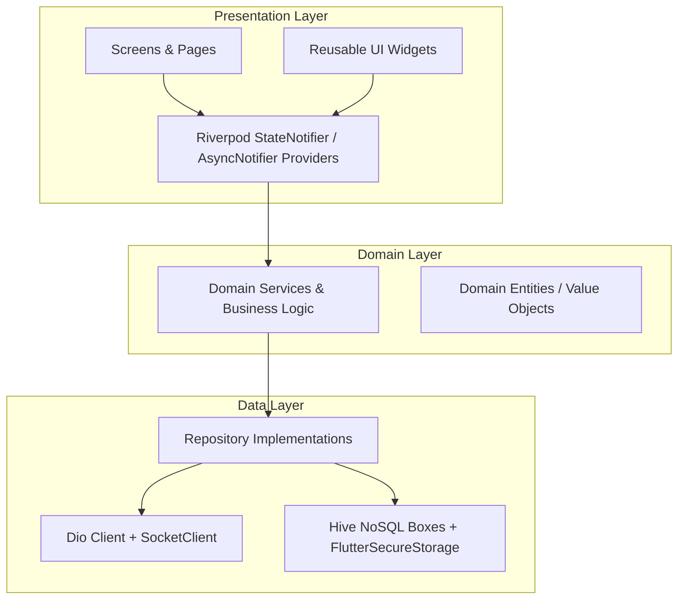

# AgriEtech Flutter Mobile Client (`agrietech_ewa_app`)
> **Cross-Platform Multi-Hazard Early Warning & Climate Advisory Mobile Client for Ethiopia**

---

## 📖 Executive Summary & Mission
The AgriEtech mobile application is a high-performance, offline-first Flutter application designed for smallholder farmers, agricultural extension workers (Development Agents), and Woreda agricultural officers across Ethiopia.

### Key Capabilities:
1. **Interactive Multi-Hazard Dashboard**: Live composite risk visualizations for Drought, Flood, Desert Locust, and Vegetation Stress.
2. **Offline-First Resilience**: Automatic local caching via Hive NoSQL; full access to historical forecasts and advisories even without cellular reception in remote kebeles.
3. **Bilingual Localization**: Native support for **Amharic (አማርኛ)** with Ge'ez script support alongside **English**.
4. **Farm Geofencing**: Interactive GPS boundary drawing on OpenStreetMap using `flutter_map`.
5. **Agro-Meteorological Analytics**: 16-day meteograms, dekadal rainfall charts, and seasonal Belg/Kiremt comparison via `fl_chart`.
6. **AI Crop Disease Diagnosis**: Leaf photo capture and instant pathology diagnosis with agronomic treatments.
7. **Real-time Alert Push & WebSockets**: Instant hazard warnings with audio and push notifications.

---

## 🏛️ Architecture Topology (Clean Architecture + Feature-First)



---

## 📂 Source Code Layout & Responsibilities

```
agrietech-frontend/
├── assets/
│   ├── images/                             # Brand assets, illustrations, agro-icons
│   ├── icons/                              # Hazard icons (drought, flood, locust, leaf)
│   └── translations/
│
├── lib/
│   ├── main.dart                           # Entry point, Hive bootstrap, ProviderScope
│   ├── app.dart                            # MaterialApp.router, Material 3 Theme, Localization
│   │
│   ├── core/                               # CORE REUSABLE INFRASTRUCTURE
│   │   ├── config/
│   │   │   ├── env.dart                    # AppEnv configuration (API base URLs)
│   │   │   ├── app_theme.dart              # Earth Green & Warning Amber Theme tokens
│   │   │   └── app_router.dart             # GoRouter route declarations & bottom nav shell
│   │   ├── constants/
│   │   │   ├── api_endpoints.dart          # REST API endpoints
│   │   │   └── app_constants.dart          # Business constants & cache durations
│   │   ├── network/
│   │   │   ├── dio_client.dart             # Configured Dio instance
│   │   │   ├── api_interceptors.dart       # JWT Bearer token & error interceptors
│   │   │   └── socket_client.dart          # Socket.IO client for live alert streams
│   │   ├── storage/
│   │   │   ├── secure_storage_service.dart # FlutterSecureStorage for auth tokens
│   │   │   ├── hive_service.dart           # Hive NoSQL initialization & adapters
│   │   │   └── local_cache_boxes.dart      # Cache box identifiers
│   │   ├── localization/
│   │   │   ├── app_localizations.dart      # Localization contracts
│   │   │   └── l10n/
│   │   │       ├── app_en.arb              # English translation dictionary
│   │   │       └── app_am.arb              # Amharic (አማርኛ) translation dictionary
│   │   ├── utils/
│   │   │   ├── date_utils.dart             # Ethiopian (Ge'ez) date converters
│   │   │   ├── geo_utils.dart              # GPS & polygon area calculators
│   │   │   └── validators.dart             # Ethiopian phone & form validators
│   │   └── widgets/
│   │       ├── period_toggle.dart          # Segmented daily/dekadal/monthly filter
│   │       ├── risk_badge.dart             # Severity status chip (LOW/MODERATE/HIGH/CRITICAL)
│   │       ├── loading_indicator.dart      # Animated shimmer / circular progress
│   │       └── error_view.dart             # Offline error view with retry button
│   │
│   ├── features/                           # 14 INDEPENDENT DOMAIN MODULES
│   │   ├── auth/                           # Login, Register, OTP verification
│   │   ├── boundaries/                     # Cascading Region -> Zone -> Woreda selector
│   │   ├── farms/                          # Farm polygon boundary editor & plot details
│   │   ├── weather/                        # 16-day meteogram & historical charts
│   │   ├── drought/                        # Radial drought risk gauge & SPI trends
│   │   ├── flood/                          # GloFAS discharge hydrograph chart
│   │   ├── vegetation/                     # MODIS/Sentinel NDVI index charts
│   │   ├── locustPest/                     # FAO Locust swarm map overlay & GPS proximity
│   │   ├── soil/                           # SoilGrids nutrient & moisture bars
│   │   ├── diseaseDiagnosis/               # Camera photo upload & AI pathology advice
│   │   ├── riskDashboard/                  # Multi-hazard composite overview card & map
│   │   ├── alerts/                         # Advisory notification inbox
│   │   ├── analytics/                      # Belg/Kiremt comparative analytics
│   │   └── offlineSync/                    # Workmanager background sync queue
│   │
│   └── shared/                             # ApiResponse models & BuildContext extensions
│
└── docs/                                   # 📚 Comprehensive Documentation
    ├── ARCHITECTURE_OVERVIEW.md            # Mobile architecture & data layer patterns
    ├── STATE_MANAGEMENT_GUIDE.md           # Riverpod 2.x & Hive offline caching guide
    ├── UI_UX_DESIGN_SYSTEM.md              # Material 3 tokens, colors & Amharic fonts
    ├── FEATURE_ROADMAP.md                  # Screen-by-screen feature specifications
    ├── OFFLINE_FIRST_AND_SYNC_GUIDE.md     # Offline resilience & Workmanager sync
    └── TEAM_ASSIGNMENT_GUIDE.md            # Frontend developer task matrix
```

---

## ⚡ Quick Start & Running the App

### 1. Requirements
- **Flutter SDK**: `>= 3.19.0`
- **Dart SDK**: `>= 3.3.0`
- Android Studio / Xcode / VS Code with Flutter Extension

### 2. Setup Commands
```bash
# 1. Navigate to frontend directory
cd agrietech-frontend

# 2. Configure environment
cp .env.example .env

# 3. Install Flutter dependencies
flutter pub get

# 4. Run the app on emulator or connected device
flutter run
```

---

## 📑 Team Documentation Hub
Every frontend engineer must review their assigned documentation:
- 📱 [Frontend Architecture Overview](./docs/ARCHITECTURE_OVERVIEW.md)
- 🔄 [State Management & Riverpod Guide](./docs/STATE_MANAGEMENT_GUIDE.md)
- 🎨 [UI/UX Design System Guidelines](./docs/UI_UX_DESIGN_SYSTEM.md)
- 🗺️ [Feature Roadmap & Screens](./docs/FEATURE_ROADMAP.md)
- 💾 [Offline-First & Sync Guide](./docs/OFFLINE_FIRST_AND_SYNC_GUIDE.md)
- 👥 [Frontend Team Assignment Guide](./docs/TEAM_ASSIGNMENT_GUIDE.md)
