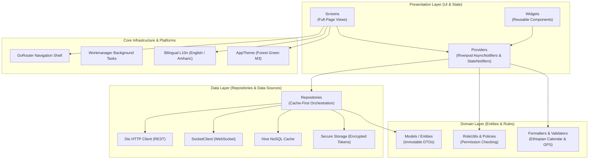
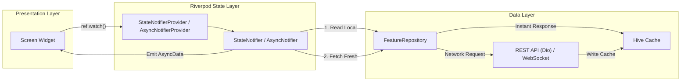
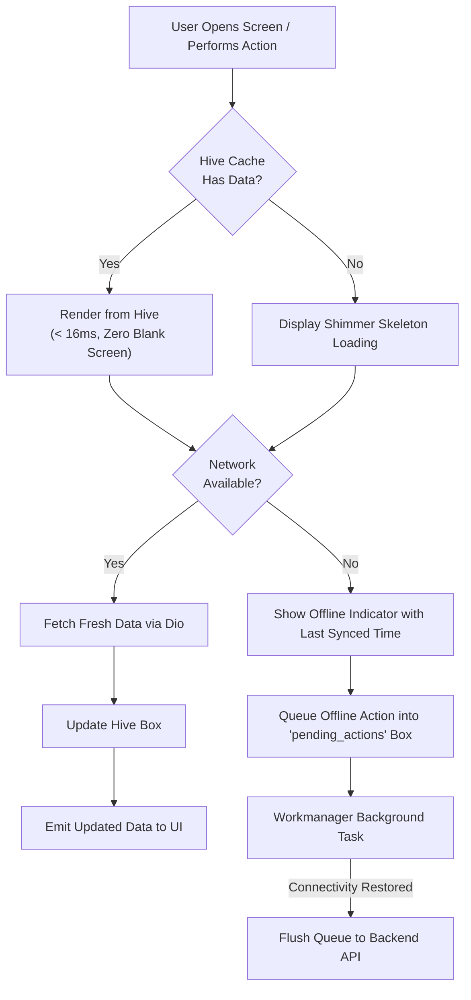

# AgriEtech Frontend Architecture Guide

This document outlines the technical architecture, design patterns, state management, offline-first persistence, role-based access control, and remote communication layer for the **agriEtech** Flutter mobile and web client.

---

## 1. Technology Stack

| Layer | Technology | Version | Purpose |
|---|---|---|---|
| **Framework** | Flutter | >= 3.0.0 | Cross-platform UI for Android, iOS, Web, and Desktop |
| **Language** | Dart | >= 3.0.0 | Type-safe application logic with sound null-safety |
| **State Management** | Riverpod 2.x | ^2.6.1 | Reactive, testable state with `AsyncNotifier` & `StateNotifierProvider` |
| **Navigation** | GoRouter | ^14.0.1 | Declarative routing with nested shell navigation & auth guards |
| **HTTP Client** | Dio | ^5.4.3 | Interceptor-capable networking with JWT handling & auto-retry |
| **Local Database** | Hive | ^2.2.3 | Offline-first high-speed NoSQL key-value cache |
| **Secure Storage** | flutter_secure_storage | ^9.0.0 | Encrypted keystore storage for auth tokens & credentials |
| **Maps** | flutter_map + latlong2 | ^6.1.0 | OpenStreetMap tile rendering, polygon drawing & geofencing |
| **Charts** | fl_chart | ^0.68.0 | Interactive meteograms, hydrographs, telemetry & gauges |
| **Background Sync** | Workmanager | ^0.5.2 | Periodic offline queue synchronization in background |
| **Connectivity** | connectivity_plus | ^5.0.2 | Real-time network reachability detection & sync trigger |
| **Real-Time Stream** | socket_io_client | ^3.0.2 | WebSocket push alerts, sensor telemetry & Woreda live streams |
| **Localization** | intl + Flutter Gen | ^0.20.2 | Bilingual (Amharic & English) string management |

---

## 2. Clean Architecture Pattern

**agriEtech** adheres strictly to Clean Architecture principles with decoupled boundaries across four primary architectural layers:



### Architectural Principles & Dependency Rules:
1. **Unidirectional Data Flow**: Data flows upward from Repositories → Providers → UI Screens. User actions flow downward via Provider methods.
2. **Provider Isolation**: UI Screens and Widgets depend solely on Riverpod providers via `ref.watch()` or `ref.read()`. Direct HTTP or database operations inside widgets are forbidden.
3. **Repository Pattern (Cache-First)**: Repositories orchestrate between remote REST/WebSocket services and local Hive cache. Cache is checked first for sub-16ms instant screen rendering before network dispatch.
4. **Role-Based Access Control (RBAC)**: All sensitive operations, screens, and actions are guarded by `RoleUtils` evaluating the 5 user roles (`FARMER`, `DEVELOPMENT_AGENT`, `WOREDA_OFFICER`, `RESEARCHER`, `ADMIN`).
5. **Brand Identity**: UI follows the unified 3-segment **agriEtech** typography and Forest Green (`#2E7D32` / `#1B5E20`) design tokens.

---

## 3. Reactive State Management (Riverpod 2.x)

Data loading and mutations utilize Riverpod 2.x `AsyncNotifier` and `StateNotifier` to maintain structured `AsyncValue` lifecycle states (`AsyncLoading`, `AsyncData`, `AsyncError`).



### Standard Repository Pattern Implementation:
```dart
// Example: Cache-First Farm Repository
class FarmRepository {
  final DioClient _dioClient;
  final HiveService _hiveService;

  FarmRepository(this._dioClient, this._hiveService);

  Future<List<FarmModel>> getFarms({bool forceRefresh = false}) async {
    // 1. Return cached data immediately if available and fresh
    if (!forceRefresh) {
      final cached = _hiveService.getFarms();
      if (cached.isNotEmpty) return cached;
    }

    // 2. Fetch fresh data from backend
    final response = await _dioClient.get('/farms');
    final farms = (response.data as List)
        .map((json) => FarmModel.fromJson(json))
        .toList();

    // 3. Cache locally in Hive
    await _hiveService.saveFarms(farms);
    return farms;
  }
}
```

---

## 4. Low-Connectivity & Offline-First Strategy

Smallholder farmers and field agents in rural Ethiopia frequently operate in low or zero connectivity zones. **agriEtech** applies an offline-first architecture:



### Hive Box Storage Matrix:

| Box Name | Cached Domain | TTL | Sync Policy |
|---|---|---|---|
| `weather_cache` | 16-day forecasts, hourly temperatures | 1 hour | Pull-to-refresh & app foreground |
| `risk_cache` | Composite Woreda risk score & hazard indices | 4 hours | Push event & background worker |
| `farms_cache` | Farm polygons, GPS coordinates, crop metadata | 24 hours | On CRUD mutation / manual refresh |
| `alerts_cache` | Active advisories, severity levels, notifications | 7 days | WebSocket stream & FCM push |
| `sensors_cache` | Sensor telemetry history & battery levels | 12 hours | WebSocket telemetry stream |
| `boundary_cache` | Region → Zone → Woreda administrative hierarchy | 30 days | Setup / periodic update |
| `pending_actions`| Offline mutations (farm creation, diagnosis, reports)| Persistent | Flushed on connectivity restore |

### Conflict Resolution Strategy:
1. **Last-Write-Wins**: User profile information and farm metadata.
2. **Server-Authoritative**: Composite risk scores, satellite NDVI, FAO locust swarm coordinates, and meteorological models.
3. **Append-Only**: Disease diagnosis submissions and sensor telemetry readings.

---

## 5. Authentication, Security & RBAC

- **JWT Authentication**: Supports login via **Username or Email** alongside secure password authentication.
- **Token Lifecycle**: Short-lived JWT access tokens + refresh tokens stored securely in `FlutterSecureStorage`.
- **Automatic Interception**: `ApiInterceptors` transparently attaches Bearer tokens and handles token refresh upon `401 Unauthorized` responses.
- **Forgot Password Flow**: Password reset request dialog integrated into the login screen with email token dispatch.
- **Role Permissions Matrix**:
  - `FARMER`: View local weather, manage owned farms, receive alerts, submit disease photos.
  - `DEVELOPMENT_AGENT`: Register farmers, map farm GPS polygons, view sensor telemetry, create field reports.
  - `WOREDA_OFFICER`: Broadcast Woreda-level alerts, view multi-hazard risk dashboards, manage woreda resources.
  - `RESEARCHER`: Access climatology trends, NDVI analytics, export raw telemetry.
  - `ADMIN`: User management, system configuration, boundary administration, full CRUD access.
