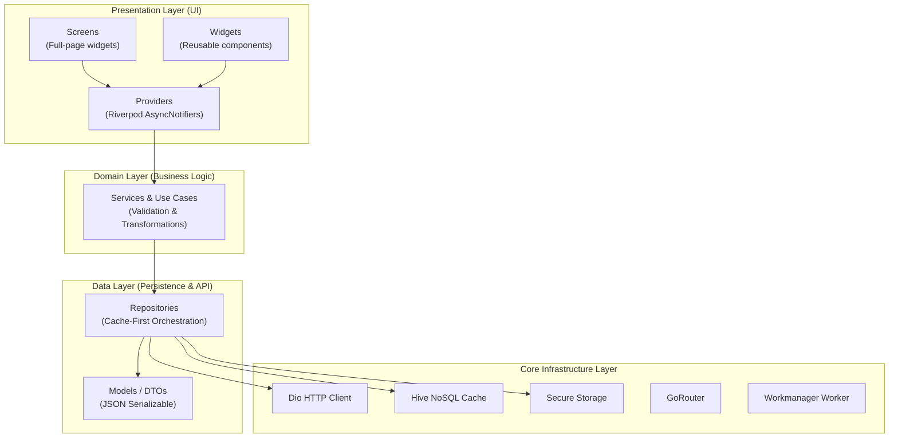
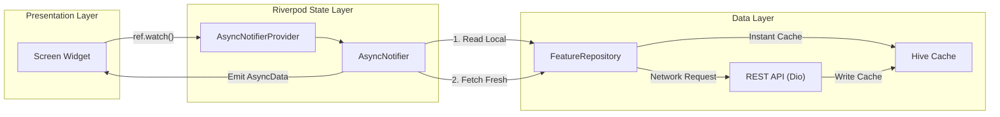
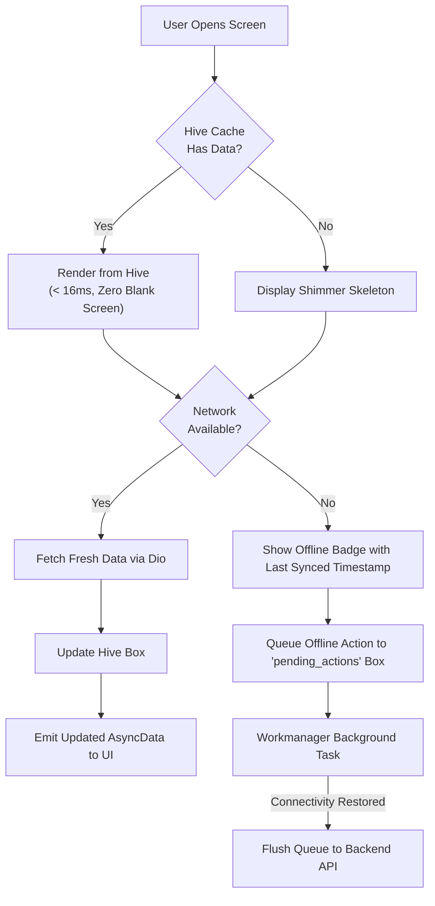

# AgriEtech Frontend Architecture Guide

This document outlines the technical architecture, design patterns, state management, offline-first persistence, and remote communication layer for the AgriEtech Flutter mobile client.

---

## 1. Technology Stack

| Layer | Technology | Version | Purpose |
|---|---|---|---|
| **Framework** | Flutter | >= 3.0.0 | Cross-platform mobile UI for Android & iOS |
| **Language** | Dart | >= 3.0.0 | Type-safe application logic with null-safety |
| **State Management** | Riverpod 2.x | ^2.5.1 | Reactive, testable state with `AsyncNotifier` |
| **Navigation** | GoRouter | ^14.0.1 | Declarative routing with nested shell navigation |
| **HTTP Client** | Dio | ^5.4.3 | Interceptor-capable networking with JWT handling |
| **Local Database** | Hive | ^2.2.3 | Offline-first high-speed NoSQL key-value cache |
| **Secure Storage** | flutter_secure_storage | ^9.0.0 | Encrypted keystore storage for auth tokens |
| **Maps** | flutter_map + latlong2 | ^6.1.0 | OpenStreetMap tile rendering & polygon drawing |
| **Charts** | fl_chart | ^0.68.0 | Interactive meteograms, hydrographs & gauges |
| **Background Sync** | Workmanager | ^0.5.2 | Periodic offline queue sync in background |
| **Connectivity** | connectivity_plus | ^5.0.2 | Real-time network reachability detection |
| **Real-Time Stream** | socket_io_client | ^2.0.3 | WebSocket push alerts & woreda live streams |
| **Localization** | intl + Flutter Gen | ^0.20.2 | Bilingual (Amharic & English) string management |

---

## 2. Clean Architecture Pattern

AgriEtech follows Clean Architecture with strict separation of concerns across 3 primary layers:



### Dependency Rules:
1. **Screens & Widgets** depend solely on **Providers** via `WidgetRef.watch()` or `WidgetRef.read()`.
2. **Providers** call **Services** or **Repositories**. They never instantiate HTTP clients directly.
3. **Repositories** encapsulate data fetching policies (Cache-First -> Network -> Update Cache).
4. **Models** are immutable data transfer objects with zero framework dependencies.

---

## 3. Reactive State Management (Riverpod 2.x)

All asynchronous data flows use Riverpod 2.x `AsyncNotifierProvider` to maintain structured `AsyncValue` lifecycle states (`AsyncLoading`, `AsyncData`, `AsyncError`).



### Standard Provider Pattern:
```dart
// Provider Definition
final weatherProvider = AsyncNotifierProvider<WeatherNotifier, WeatherState>(
  WeatherNotifier.new,
);

// Notifier Implementation
class WeatherNotifier extends AsyncNotifier<WeatherState> {
  @override
  Future<WeatherState> build() async {
    final repository = ref.read(weatherRepositoryProvider);
    return repository.getForecast();
  }

  Future<void> refresh() async {
    state = const AsyncLoading();
    state = await AsyncValue.guard(
      () => ref.read(weatherRepositoryProvider).getForecast(forceRefresh: true),
    );
  }
}
```

---

## 4. Low-Connectivity & Offline-First Strategy

Smallholder farmers in rural Ethiopia frequently operate in regions with poor or zero connectivity. The application implements an aggressive **Cache-First** strategy:



### Hive Box Storage Strategy:

| Box Name | Data Cached | TTL | Refresh Trigger |
|---|---|---|---|
| `weather_cache` | 16-day forecasts, hourly temperatures | 1 hour | App foreground, pull-to-refresh |
| `risk_cache` | Composite Woreda risk score | 4 hours | Background sync worker / push event |
| `farms_cache` | Farm polygons, area, crop details | 24 hours | On farm creation / edit |
| `alerts_cache` | Advisory warnings & push notifications | 7 days | WebSocket stream / FCM push |
| `boundary_cache` | Region / Zone / Woreda hierarchies | 30 days | Initial setup / app update |
| `pending_actions`| Queued offline farm additions & reports | Until Synced | Workmanager network callback |

### Conflict Resolution Strategy:
1. **Last-Write-Wins**: Applied to user profile details and farm metadata.
2. **Server-Authoritative**: Applied to composite risk scores, satellite NDVI observations, and locust positions.
3. **Append-Only**: Applied to offline disease diagnosis records and sensor telemetry.

---

## 5. Network & Security Architecture

- **Dio Client**: Pre-configured with 15-second timeouts, global error interceptor, and automatic token attachment.
- **JWT Authentication**: Access tokens are stored in `FlutterSecureStorage` and automatically attached via `ApiInterceptors`.
- **WebSocket Streaming**: Socket.IO client connects to woreda-specific broadcast channels (`/risk-assessments`, `/alerts`) for real-time push advisories without polling.
