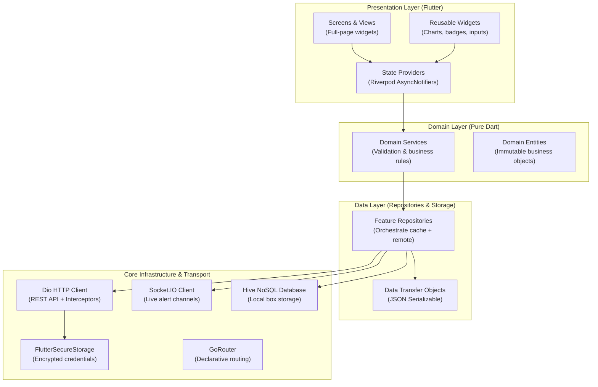

# Frontend Architecture & System Topology

> Architectural guidelines, dependency boundaries, and runtime patterns for the AgriEtech Flutter client.

---

## 1. Architectural Principles

The AgriEtech mobile application adheres to three core architectural principles:

1. **Clean Architecture (Separation of Concerns)**: Clear boundaries between Presentation (UI/Widgets), State (Riverpod Providers), Domain (Business Rules), and Data (Repositories, HTTP, Local Storage).
2. **Dual-Mode Operational Resilience**: The client provides rich real-time online functionality (WebSocket streaming, cloud inference, on-demand satellite queries) and continuous offline operability (Hive local caching, offline action queue, background reconciliation).
3. **Unidirectional Data Flow**: State flows down from providers to UI widgets; user events trigger notifier actions that communicate through repositories to network/storage infrastructure.

---

## 2. Layer Topology

---

## 3. Technology Stack & Frameworks

| Component | Library / Framework | Version | Purpose |
|---|---|---|---|
| **Framework** | Flutter | `>= 3.19.0` | Cross-platform UI compilation for Android & iOS |
| **Language** | Dart | `>= 3.3.0` | Strongly typed object-oriented execution |
| **State Management** | `flutter_riverpod` | `^2.5.1` | Compile-safe reactive state container |
| **Routing** | `go_router` | `^14.0.1` | Declarative URI-based deep linking and shell routing |
| **Networking** | `dio` | `^5.4.3` | Interceptor-capable HTTP client with retry policies |
| **Live Streaming** | `socket_io_client` | `^2.0.3+1` | Real-time WebSocket connection to backend alerts |
| **Local Cache** | `hive` / `hive_flutter` | `^2.2.3` | Lightweight NoSQL key-value database for offline cache |
| **Secure Keyring** | `flutter_secure_storage` | `^9.0.0` | Hardware-backed keystore encryption for JWT tokens |
| **Map Rendering** | `flutter_map` / `latlong2` | `^6.1.0` | Vector and raster tile map rendering with polygon editor |
| **Data Visualization** | `fl_chart` | `^0.68.0` | High-performance meteograms, hydrographs, and line curves |
| **Background Sync** | `workmanager` | `^0.5.2` | OS-level periodic task executor for data synchronization |
| **Push Notifications** | `firebase_messaging` | `^14.9.1` | Cloud-to-device push notification delivery |
| **Localization** | `intl` + `.arb` | `^0.20.2` | Bilingual Amharic (አማርኛ) and English dictionary support |

---

## 4. Feature Domain Inventory

The `lib/features/` folder is divided into 14 self-contained vertical slices:

| Domain Directory | Primary Features & UI | Primary Provider | Data Source & Cache Box |
|---|---|---|---|
| `features/auth/` | Phone login, registration, OTP validation | `authProvider` | `POST /api/v1/auth/*` · `SecureStorage` |
| `features/boundaries/` | Cascading Region $\rightarrow$ Zone $\rightarrow$ Woreda selector | `boundariesProvider` | `GET /api/v1/boundaries/*` · `boundary_cache` |
| `features/farms/` | Farm list, acreage calculator, GPS polygon editor | `farmsProvider` | `/api/v1/farms` · `farms_cache` |
| `features/weather/` | 16-day meteogram, hourly temperature, precipitation | `weatherProvider` | Open-Meteo API via backend · `weather_cache` |
| `features/drought/` | Radial SPI gauge, 30/90-day precipitation deficit | `droughtProvider` | CHIRPS SPI processor · `risk_cache` |
| `features/flood/` | GloFAS discharge hydrograph, return period risk | `floodProvider` | GloFAS hydrological API · `risk_cache` |
| `features/vegetation/` | MODIS / Sentinel-2 NDVI anomaly trend curves | `vegetationProvider`| Satellite ingest service · `risk_cache` |
| `features/locustPest/` | FAO swarm polygons and GPS distance calculator | `locustProvider` | FAO Desert Locust Hub · `risk_cache` |
| `features/soil/` | SoilGrids nutrient bars (pH, Nitrogen, Sand, Clay) | `soilProvider` | SoilGrids 250m REST · `farms_cache` |
| `features/diseaseDiagnosis/` | Camera viewfinder capture and AI disease advice | `diseaseProvider` | Plant.id cloud inference proxy |
| `features/riskDashboard/` | Multi-hazard woreda summary and composite map | `riskDashboardProvider`| Composite aggregator · `risk_cache` |
| `features/alerts/` | Advisory inbox with bilingual recommendation cards | `alertsProvider` | Socket.IO + REST · `alerts_cache` |
| `features/analytics/` | Multi-year historical climatology vs Belg/Kiremt | `analyticsProvider` | Agro-analytics engine · `weather_cache` |
| `features/offlineSync/` | Background mutation worker and conflict resolver | `syncServiceProvider` | Workmanager + Dio batch sync |

---

## 5. Architectural Invariants & Rules

1. **Dependency Inversion**: High-level modules (Presentation/Domain) never import low-level modules directly. Repositories hide network and database implementation details behind clean abstract contracts.
2. **Immutability**: All domain entities and state objects are immutable. State transitions occur strictly by creating new state instances via `copyWith()`.
3. **Graceful Degradation**: If an API endpoint times out or cellular data is unavailable, the repository retrieves the last known valid payload from Hive and emits a cached state with an offline metadata tag.

