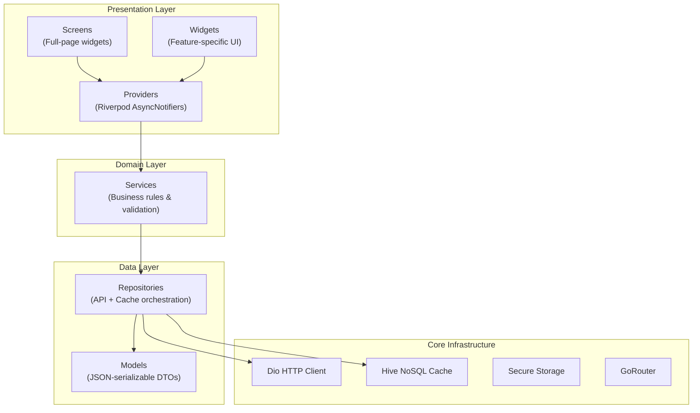

# Frontend Architecture Overview

## Technology Stack

| Layer | Technology | Version | Purpose |
|---|---|---|---|
| **Framework** | Flutter | >= 3.0.0 | Cross-platform mobile UI |
| **Language** | Dart | >= 3.0.0 | Type-safe application logic |
| **State Management** | Riverpod 2.x | ^2.5.1 | Reactive, testable state |
| **Navigation** | GoRouter | ^14.0.1 | Declarative route management |
| **HTTP Client** | Dio | ^5.4.3 | Interceptor-capable networking |
| **Local Database** | Hive | ^2.2.3 | Offline-first NoSQL cache |
| **Maps** | flutter_map | ^6.1.0 | OSM-based tile rendering |
| **Charts** | fl_chart | ^0.68.0 | Meteograms, gauges, trends |
| **Background Sync** | Workmanager | ^0.5.2 | Periodic offline sync tasks |
| **Push Notifications** | Firebase Messaging | ^14.9.1 | FCM push delivery |
| **Localization** | intl + ARB files | ^0.20.2 | Amharic & English bilingual |
| **Serialization** | Freezed + json_serializable | — | Immutable models with codegen |

## Clean Architecture Layers

## Feature Domain Inventory

| # | Feature | Directory | Key Screens |
|---|---|---|---|
| 1 | Authentication | `features/auth/` | Login, Register |
| 2 | Admin Boundaries | `features/boundaries/` | Location Picker (Region→Zone→Woreda) |
| 3 | Farm Management | `features/farms/` | Farm List, Add Farm, Farm Detail, Polygon Map |
| 4 | Weather & Forecast | `features/weather/` | Weather Dashboard, Rainfall Chart |
| 5 | Drought Risk | `features/drought/` | Drought Risk Screen, SPI Gauge |
| 6 | Flood Risk | `features/flood/` | Flood Risk Screen, Basin Discharge Chart |
| 7 | Vegetation Health | `features/vegetation/` | Vegetation Health Screen, NDVI Chart |
| 8 | Desert Locust | `features/locust_pest/` | Locust Alerts Screen, Map Overlay |
| 9 | Soil Chemistry | `features/soil/` | Soil Profile Screen, Nutrient Bar |
| 10 | Disease Diagnosis | `features/disease_diagnosis/` | Leaf Photo Capture, Diagnosis Result |
| 11 | Risk Dashboard | `features/risk_dashboard/` | Multi-Hazard Dashboard, Risk Summary Card |
| 12 | Alerts & Advisories | `features/alerts/` | Alerts Inbox, Alert Detail |
| 13 | Seasonal Analytics | `features/analytics/` | Seasonal Comparison Charts |
| 14 | Offline Sync | `features/offline_sync/` | Background Sync Worker, Sync Service |

## Dependency Rule

> Inner layers NEVER depend on outer layers. Data flows inward through interfaces.

- **Screens** → depend on **Providers** (never on Repositories directly)
- **Providers** → depend on **Services** or **Repositories**
- **Repositories** → depend on **Dio** and **Hive** (infrastructure)
- **Models** → pure data classes with zero framework dependencies
