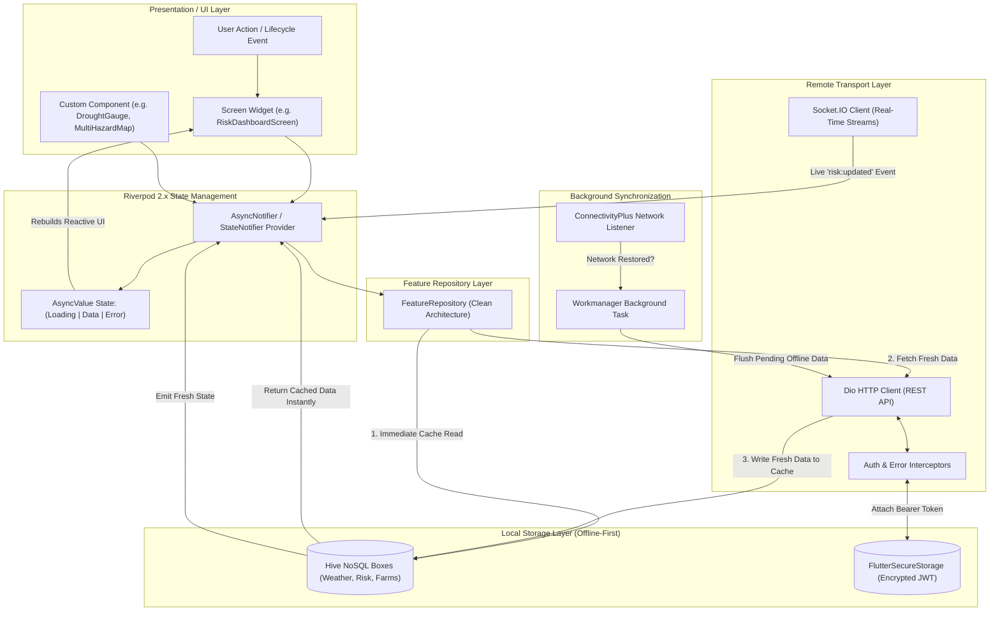

# Frontend Data Flow, Offline Caching & Architecture Diagrams

This document details the reactive state management and offline-first synchronization architecture of the AgriEtech Flutter mobile client.

---

## 1. Complete Mobile Client State & Caching Architecture Diagram

---

## 2. Low-Connectivity Offline-First Strategy
1. **Zero Blank Screens**: When navigating between screens (Weather, Risk, Farms, Soil), the app loads from Hive NoSQL cache in **< 16 milliseconds**.
2. **Graceful Network Handling**: If the phone is in an area without signal (e.g. deep rural fields), the app displays cached data alongside a subtle banner indicating the timestamp of the last satellite synchronization.
3. **Offline Field Action Logging**: Development agents can register new farm boundary polygons or take crop disease photos completely offline. The records are saved in Hive and automatically uploaded by `BackgroundSyncWorker` when network connectivity returns.
