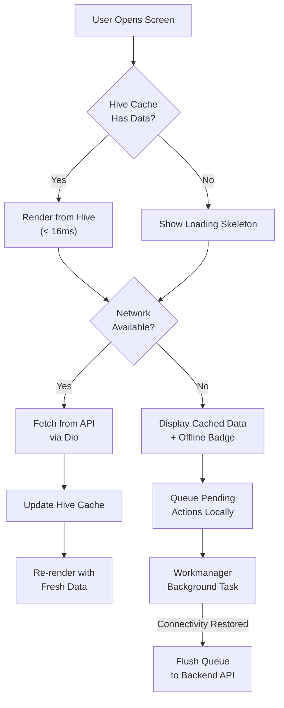

# Offline-First Architecture & Background Sync Guide

## Why Offline-First?

AgriEtech serves Ethiopian smallholder farmers in rural areas with limited or intermittent mobile connectivity. The app must:

1. **Render instantly** from local cache — even with zero network
2. **Queue user actions** (field reports, sensor readings) for later sync
3. **Reconcile data** automatically when connectivity is restored

## Architecture Overview

## Hive Box Strategy

| Box Name | Data Cached | TTL | Refresh Trigger |
|---|---|---|---|
| `weather_cache` | 16-day forecasts, hourly data | 1 hour | App foreground, pull-to-refresh |
| `risk_cache` | Woreda risk assessments | 4 hours | Background Workmanager task |
| `farm_cache` | User's farm polygons and profiles | 24 hours | After farm CRUD operations |
| `alert_cache` | Received alert notifications | 7 days | Push notification / WebSocket |
| `boundary_cache` | Region/Zone/Woreda hierarchy | 30 days | First app launch only |
| `pending_actions` | Queued offline mutations | Until synced | Background sync worker |

## Key Files

| File | Purpose |
|---|---|
| `lib/core/storage/hive_service.dart` | Hive initialization and box management |
| `lib/features/offline_sync/data/background_sync_worker.dart` | Workmanager periodic task registration |
| `lib/features/offline_sync/domain/sync_service.dart` | Conflict resolution and queue flush logic |

## Conflict Resolution Strategy

When the app comes back online and flushes pending actions:

1. **Last-Write-Wins** for simple field updates (e.g., farm name changes)
2. **Server-Authoritative** for computed data (risk scores, satellite observations)
3. **Append-Only** for telemetry readings (sensor data is never overwritten)

## Connectivity Detection

Uses `connectivity_plus` package to detect network state changes:
- **WiFi / Mobile Data detected** → Trigger immediate sync
- **No connectivity** → Continue offline, queue all mutations
- **Metered connection** → Sync text data only, defer image uploads
