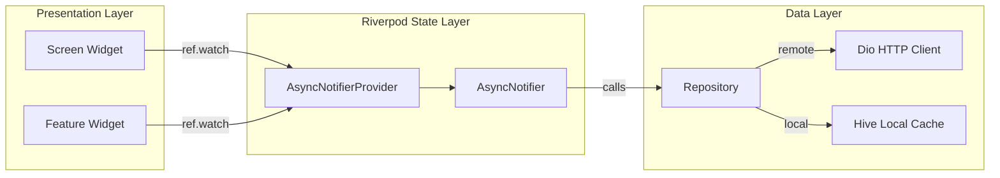

# State Management Architecture Guide

## Overview

AgriEtech uses **Riverpod 2.x** with the `AsyncNotifier` pattern for predictable, testable, and type-safe reactive state management across all 14 feature domains.

## State Flow Architecture



## Provider Patterns

### AsyncNotifierProvider (Recommended for all features)

```dart
// Provider definition
final weatherProvider = AsyncNotifierProvider<WeatherNotifier, WeatherState>(
  WeatherNotifier.new,
);

// Notifier implementation
class WeatherNotifier extends AsyncNotifier<WeatherState> {
  @override
  Future<WeatherState> build() async {
    final repo = ref.read(weatherRepositoryProvider);
    return repo.getWeatherForecast();
  }

  Future<void> refresh() async {
    state = const AsyncLoading();
    state = await AsyncValue.guard(() => ref.read(weatherRepositoryProvider).getWeatherForecast());
  }
}
```

### Consuming in Widgets

```dart
class WeatherScreen extends ConsumerWidget {
  @override
  Widget build(BuildContext context, WidgetRef ref) {
    final weatherAsync = ref.watch(weatherProvider);

    return weatherAsync.when(
      loading: () => const LoadingSkeleton(),
      error: (err, stack) => ErrorDisplay(message: err.toString()),
      data: (weather) => WeatherDashboard(data: weather),
    );
  }
}
```

## State Categories

| Category | Provider Type | Example |
|---|---|---|
| **Remote Data** | `AsyncNotifierProvider` | Weather forecasts, risk assessments, satellite obs |
| **User Input** | `StateNotifierProvider` | Farm polygon drawing, photo capture |
| **Navigation** | `GoRouter` | Route state, deep linking |
| **Theme/Locale** | `StateProvider` | Dark mode toggle, language selection |
| **Auth Session** | `AsyncNotifierProvider` | JWT token, user profile, role |

## Rules

1. **Never** put business logic in widgets — always delegate to Notifiers
2. **Always** use `AsyncValue.when()` for loading/error/data rendering
3. **Cache-first**: Repositories should check Hive before making API calls
4. **Dispose safely**: Use `ref.onDispose()` to cancel streams and timers
