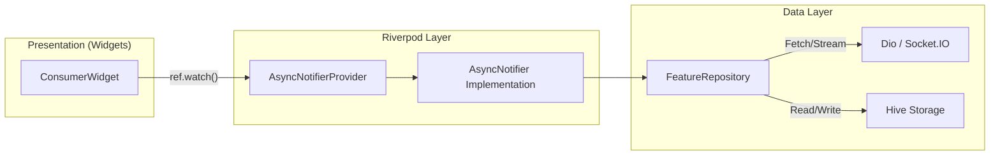

# Riverpod State Management & Reactive Data Binding

> Production patterns for state management, local caching integration, and stream consumption in AgriEtech.

---

## 1. State Architecture Overview

AgriEtech utilizes **Riverpod 2.x** with the `AsyncNotifier` / `AutoDisposeAsyncNotifier` pattern across all feature domains. This ensures:
1. **Compile-time Safety**: No runtime `ProviderNotFoundException`.
2. **Immutable State Transitions**: State is wrapped in `AsyncValue<T>`, encapsulating `data`, `loading`, and `error` conditions.
3. **Dual-Mode Coherence**: The notifier seamlessly provides cached local data while executing background remote network queries.



---

## 2. Standard Feature Notifier Implementation

Below is the standard `AsyncNotifier` implementation pattern required across all 14 feature domains:

```dart
import 'dart:async';
import 'package:flutter_riverpod/flutter_riverpod.dart';
import '../../data/models/weather_forecast_model.dart';
import '../../data/repositories/weather_repository.dart';

final weatherNotifierProvider =
    AsyncNotifierProvider<WeatherNotifier, WeatherForecastModel>(
  WeatherNotifier.new,
);

class WeatherNotifier extends AsyncNotifier<WeatherForecastModel> {
  late final WeatherRepository _repository;

  @override
  FutureOr<WeatherForecastModel> build() async {
    _repository = ref.read(weatherRepositoryProvider);
    // 1. Fetch from repository (Repository handles Hive read-through + Dio fetch)
    return _repository.getForecastForWoreda();
  }

  /// Explicit user pull-to-refresh
  Future<void> refresh() async {
    state = const AsyncValue.loading();
    state = await AsyncValue.guard(() async {
      return _repository.getForecastForWoreda(forceRefresh: true);
    });
  }

  /// Live real-time update injected from WebSocket listener
  void updateFromLiveSocket(WeatherForecastModel freshData) {
    state = AsyncValue.data(freshData);
  }
}
```

---

## 3. UI Consumer Pattern with Pattern Matching

All UI screens must consume providers via `ConsumerWidget` or `ConsumerStatefulWidget`, handling all three `AsyncValue` states cleanly:

```dart
import 'package:flutter/material.dart';
import 'package:flutter_riverpod/flutter_riverpod.dart';
import '../providers/weather_provider.dart';
import '../widgets/weather_dashboard_view.dart';
import '../../../core/widgets/loading_indicator.dart';
import '../../../core/widgets/error_view.dart';

class WeatherScreen extends ConsumerWidget {
  const WeatherScreen({super.key});

  @override
  Widget build(BuildContext context, WidgetRef ref) {
    final weatherState = ref.watch(weatherNotifierProvider);

    return Scaffold(
      appBar: AppBar(title: const Text('Agro-Weather Forecast')),
      body: weatherState.when(
        data: (weather) => RefreshIndicator(
          onRefresh: () => ref.read(weatherNotifierProvider.notifier).refresh(),
          child: WeatherDashboardView(forecast: weather),
        ),
        loading: () => const Center(child: LoadingIndicator()),
        error: (error, stackTrace) => ErrorView(
          errorMessage: error.toString(),
          onRetry: () => ref.read(weatherNotifierProvider.notifier).refresh(),
        ),
      ),
    );
  }
}
```

---

## 4. State Management Rules

1. **Zero Logic in Widgets**: Widgets must remain purely declarative. Business logic, input validation, and coordinate processing belong exclusively in Notifiers or Domain Services.
2. **Deterministic Lifecycle**: Use `.autoDispose` on short-lived presentation state (e.g. camera photo analysis or temporary filter dialogs) to prevent memory leaks.
3. **Repository Inversion**: Notifiers communicate with abstract `Repository` interfaces, never calling `Dio` or `Hive` directly.

